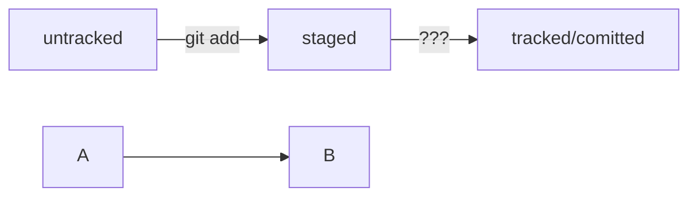

# Title
1. first task
2. second tast
3. help

*idk*

_some info_

```mermaid
graph LR;
  untracked -- "git add" --> staged;
  staged    -- "???"     --> tracked/comitted;

%% стрелка без текста для примера: 
  A --> B;
``` 

